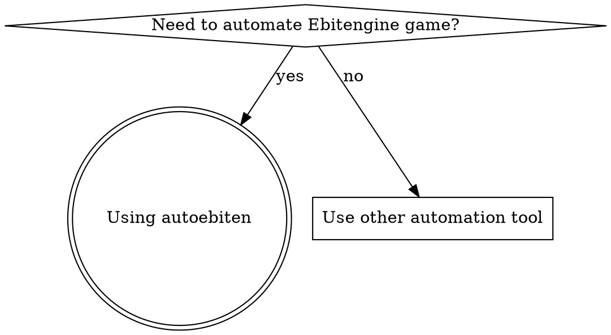
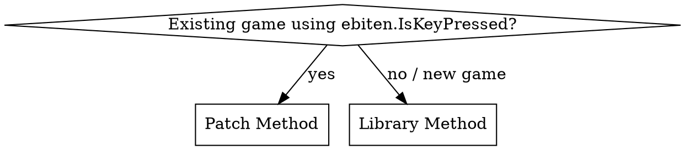
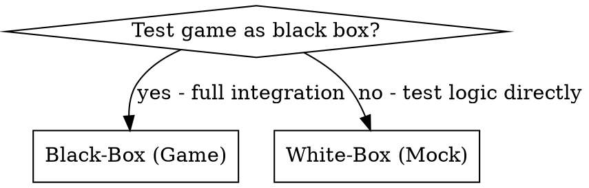

# Using AutoEbiten

## Overview

AutoEbiten automates Ebitengine games through input injection, screenshots, and scripted sequences. It provides two integration methods (Patch for existing games, Library for new games) and two testing modes (Black-box via RPC, White-box via Mock).

## When to Use

Use this skill when you need to:
- Run a game and verify it works via screenshots
- Send keyboard/mouse inputs to a running game
- Write end-to-end tests that launch the game as a separate process
- Write integration tests that test game logic in-process
- Automate game interactions via CLI commands



## Decision: Which Integration Method?



| Aspect | Patch | Library |
|--------|-------|---------|
| Code changes | None | Use `autoebiten.IsKeyPressed()` |
| Ebiten version | Locked to v2.9.9 | Any version |
| Third-party libs | Compatible | Incompatible with libs using raw Ebiten input |

**⚠️ Don't mix methods.** Patch method panics if you call `autoebiten.Update()` or `autoebiten.Capture()`.

## Decision: Which Testing Mode?



| Aspect | Black-Box (Game) | White-Box (Mock) |
|--------|------------------|------------------|
| Process | Separate | Same |
| Communication | RPC via Unix socket | Direct function calls |
| Speed | Slower (IPC overhead) | Faster |
| Use case | Full integration testing | Unit testing game logic |

---

## Part 1: CLI Verification (Run Game + Screenshot)

**Prerequisites:** Game must be autoebiten-enabled via Patch or Library method.

### Step 1: Start the Game

```bash
./mygame &
```

### Step 2: Verify Connection

```bash
autoebiten ping
```

### Step 3: Send Inputs

**Keyboard:**
```bash
# Press a key once
autoebiten input --key KeySpace --action press

# Hold for 10 ticks (~167ms at 60 TPS)
autoebiten input --key KeyW --action hold --duration_ticks 10
```

**Mouse:**
```bash
# Move cursor
autoebiten mouse --action position -x 100 -y 200

# Click left button
autoebiten mouse --action press --button MouseButtonLeft
```

**Wheel:**
```bash
autoebiten wheel -y -3
```

### Step 4: Take Screenshot

```bash
autoebiten screenshot --output shot.png
```

### Step 5: Run Scripts 

Script files support **comments** (`//` and `/* */`)

```bash
# From file
autoebiten run --script script.json

# Inline
autoebiten run --inline '{"version":"1.0","commands":[{"input":{"action":"press","key":"KeySpace"}}]}'
```

### Key Constants

List available keys:
```bash
autoebiten keys
```

Common keys: `KeyA`-`KeyZ`, `Key0`-`Key9`, `KeySpace`, `KeyEnter`, `KeyArrowUp`, `KeyArrowDown`, `KeyArrowLeft`, `KeyArrowRight`

### Target Multiple Games

```bash
# Auto-detect (if only one game running)
autoebiten ping

# Specify PID
autoebiten --pid 12345 screenshot --output shot.png
```

---

## Part 2: Black-Box Testing (E2E)

Use `testkit.Game` to launch the game in a separate process and control via RPC.

### Complete Example

```go
package mygame_test

import (
    "testing"
    "time"

    "github.com/hajimehoshi/ebiten/v2"
    "github.com/s3cy/autoebiten/testkit"
    "github.com/stretchr/testify/assert"
    "github.com/stretchr/testify/require"
)

func TestPlayerMovement(t *testing.T) {
    // Launch game binary
    game := testkit.Launch(t, "./mygame",
        testkit.WithTimeout(30*time.Second))
    defer game.Shutdown() // Always defer shutdown

    // Wait for game to be ready
    ready := game.WaitFor(func() bool {
        return game.Ping() == nil
    }, 5*time.Second)
    require.True(t, ready, "game did not become ready")

    // Get initial position
    initialX, err := game.StateQuery("gamestate", "Player.X")
    require.NoError(t, err)

    // Send input (hold for 10 ticks)
    err = game.HoldKey(ebiten.KeyArrowRight, 10)
    require.NoError(t, err)

    // Wait for movement
    time.Sleep(100 * time.Millisecond)

    // Verify position changed
    newX, err := game.StateQuery("gamestate", "Player.X")
    require.NoError(t, err)
    assert.Greater(t, newX.(float64), initialX.(float64))
}
```

### Required: Build Binary First

**CRITICAL:** Black-box tests require the game binary to be built:

```bash
go build -o ./mygame ./cmd/mygame
```

### Required: StateExporter Setup

**CRITICAL:** For `StateQuery()` to work, the game must export state:

```go
autoebiten.RegisterStateExporter("gamestate", &gameInstance)
```

Query paths use dot notation: `"Player.X"`, `"Inventory.0.Name"`, `"Skills.Sword"`
The first argument to `StateQuery` is the exporter name (e.g., `"gamestate"`), the second is the path.

### Black-Box API Reference

| Method | Description |
|--------|-------------|
| `Launch(t, binary, opts...)` | Start game process |
| `game.Shutdown()` | Stop game process |
| `game.Ping()` | Check if responsive |
| `game.WaitFor(fn, timeout)` | Poll until condition met |
| `game.HoldKey(key, ticks)` | Hold key for N ticks |
| `game.PressKey(key)` | Press and release |
| `game.MoveMouse(x, y)` | Set cursor position |
| `game.Screenshot()` | Capture as image |
| `game.StateQuery(name, path)` | Query exported state |
| `game.RunCustom(name, req)` | Execute custom command |

---

## Part 3: White-Box Testing (Integration)

Use `testkit.Mock` to test game logic in the same process with injected inputs.

### Complete Example

```go
package mygame

import (
    "testing"

    "github.com/hajimehoshi/ebiten/v2"
    "github.com/s3cy/autoebiten"
    "github.com/s3cy/autoebiten/testkit"
    "github.com/stretchr/testify/assert"
)

func TestPlayerMovesRight(t *testing.T) {
    // Set injection-only mode
    autoebiten.SetMode(autoebiten.InjectionOnly)

    // Create game directly
    game := NewGame()
    mock := testkit.NewMock(t, game)

    initialX := game.Player.X

    // Inject key press
    mock.InjectKeyPress(ebiten.KeyArrowRight)

    // Advance 10 ticks
    mock.Ticks(10)

    // Verify movement
    assert.Greater(t, game.Player.X, initialX)
}
```

### Game Requirements

Game must use `autoebiten.IsKeyPressed()` (not `ebiten.IsKeyPressed()`):

```go
func (g *Game) Update() error {
    // Correct - uses autoebiten wrapper
    if autoebiten.IsKeyPressed(ebiten.KeyArrowRight) {
        g.Player.X += 1
    }
    return nil
}
```

### White-Box API Reference

| Method | Description |
|--------|-------------|
| `NewMock(t, game)` | Create mock controller |
| `mock.InjectKeyPress(key)` | Buffer key press |
| `mock.InjectKeyRelease(key)` | Buffer key release |
| `mock.InjectMousePosition(x, y)` | Set cursor position |
| `mock.Tick()` | Advance 1 tick |
| `mock.Ticks(n)` | Advance N ticks |

---

## Common Mistakes

| Mistake | Fix |
|---------|-----|
| Black-box test fails with "binary not found" | Build binary first: `go build -o ./mygame ./cmd/mygame` |
| `StateQuery` returns error | Register `autoebiten.RegisterStateExporter` in game |
| `game.Ping()` fails | Wait for game to be ready with `game.WaitFor()` |
| Patch method panics | Don't call `autoebiten.Update()` or `autoebiten.Capture()` |
| Inputs not working in white-box | Call `mock.Tick()` after injecting inputs |

## Key Concepts

**Ticks vs FPS:** 1 tick = 1 `Update()` call. Ebiten runs at 60 TPS (ticks per second) by default, independent of FPS.

**Input Modes:**
- `InjectionOnly`: Only injected inputs
- `InjectionFallback`: Per-key fallback (default)
- `Passthrough`: All real input

**Socket Path:** `/tmp/autoebiten/autoebiten-{PID}.sock`

**Platform:** macOS and Linux only (Unix domain sockets)
